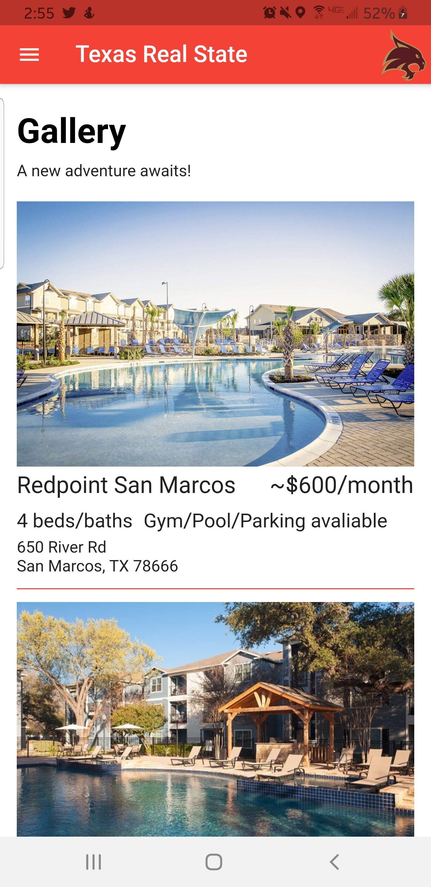
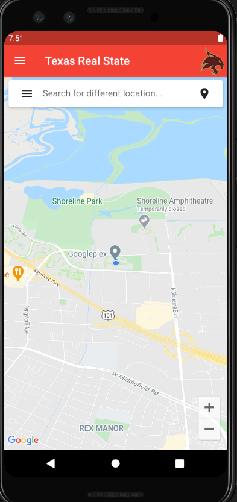
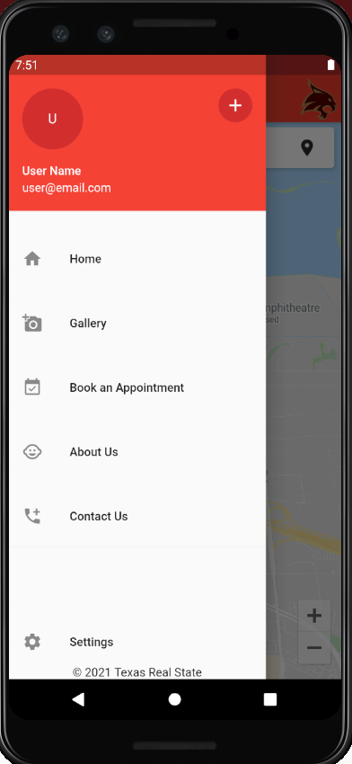

# texas_real_state
* A Flutter project created by 3 other Texas State students and myself for our Software Engineering Project class.
* This will be a real estate app called Texas Real State.

# What We Learned
* Teamwork/Collaboration
* Flutter
* Riverpod for State Management
* Google API's for Maps

# Screenshots

