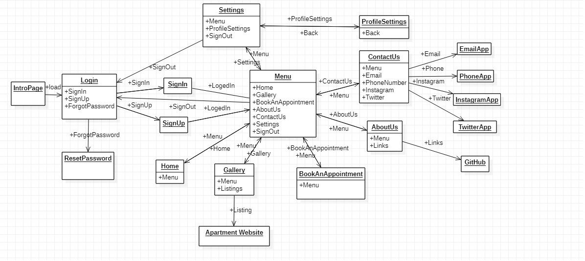
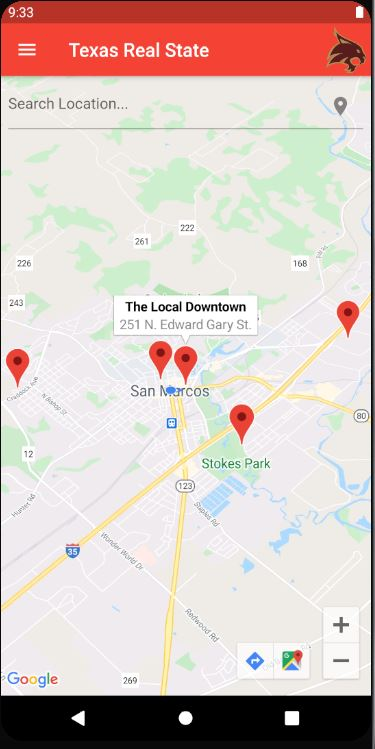
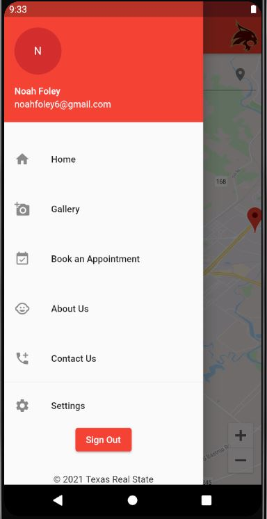
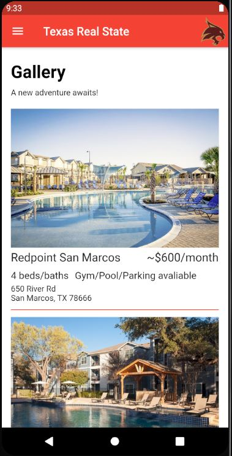
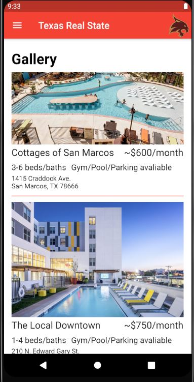
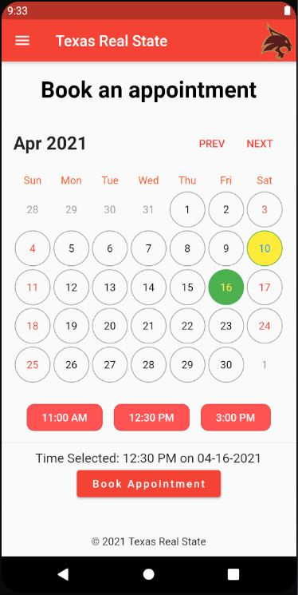
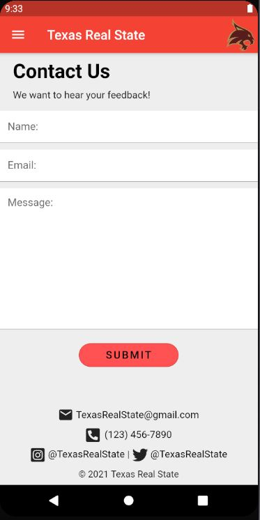
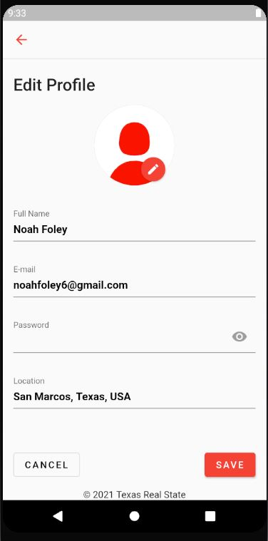

# Texas Real State
* A Flutter app created by 3 other Texas State students and myself for our Software Engineering Project class.
* This app helps incoming and current Texas State Students find apartments near Texas State University.

## What We Learned
* Teamwork/Collaboration
* Flutter
* Riverpod & Provider for State Management
* Google API's for Maps

## State Diagram

  

## Screenshots

  
  
  
  
  
  
  
  
  
  

